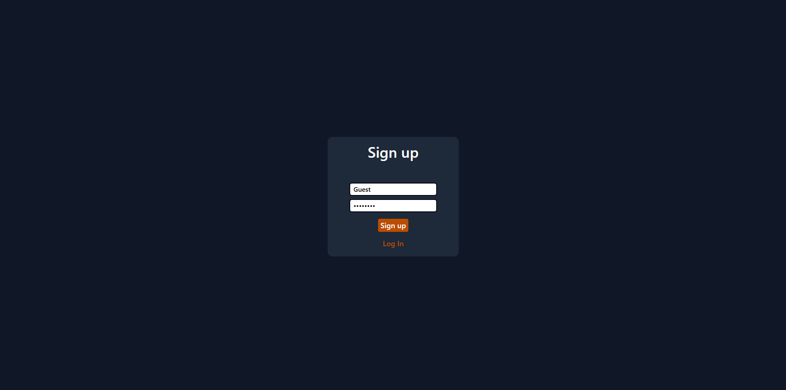
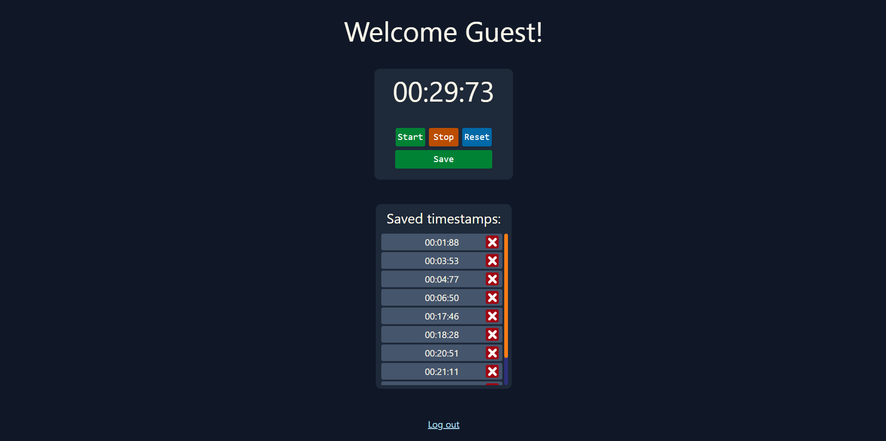
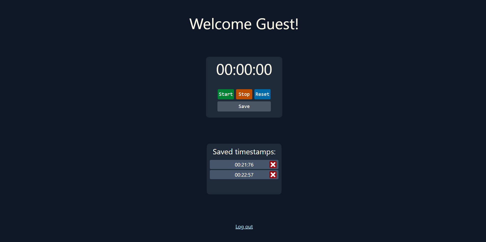
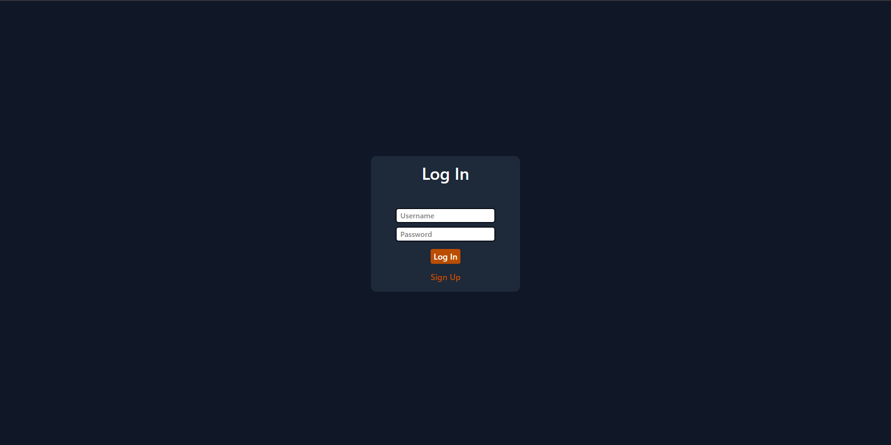

# Simple MERN Stopwatch App

This is a **learning project** I made to get better at MERN stack. I experimented with authentication, JWT tokens, rate limiting, protected routes, MongoDB, CRUD, and mapping backend data to frontend lists.

---

## What I Learned / Practiced

- **Authentication & Authorization**  
  - Signup/login with hashed passwords using **bcrypt**  
  - JWT tokens stored in **HTTP-only cookies**  
  - Protected routes that check if a user is logged in  

- **Backend**  
  - Express + Node.js  
  - Rate limiting on auth routes with 'express-rate-limit'  
  - MongoDB + Mongoose: saving users, timestamps, and connecting collections  

- **Frontend**  
  - React + Vite  
  - React Router for routing  
  - Fetching data from backend and rendering lists dynamically  
  - Sending POST, GET, DELETE requests and handling responses  
  - Simple UI with Tailwind CSS  

- **Other Learnings**  
  - Environment variables for secrets, URLs, and cookie names  
  - How to protect routes and redirect users if not logged in  
  - Use of HTTP status codes

---

## Features

- Signup & Login with hashed passwords
- JWT authentication stored in cookies
- Protected home page: you can’t access it without logging in
- Stopwatch functionality: start, stop, reset
- Save timestamps for logged-in users
- Delete timestamps dynamically from UI
- Frontend mapping of data from backend

---

## How to Run

1. **Install dependencies**  
   Run `npm install` in both the **frontend** and **backend** folders.

2. **Setup environment variables**  
   - Copy the provided `.env.example` files in both frontend and backend folders to `.env`.  
   - Fill in the required values such as `ACCESS_TOKEN_SECRET`, `MONGO_URL`, `CLIENT_URL`, etc.

3. **Ensure MongoDB is running**  
   - Install MongoDB locally or use a cloud MongoDB instance.  
   - Make sure the connection URL in your backend `.env` (`MONGO_URL`) is correct.

4. **Start the backend**  
   ```bash
   node server.js
5. **Start the frontend**  
   ```bash
   npm run dev
6. **Open the app**  
   Open your browser at http://localhost:5173

---

## Screenshots

### Signup Page


---

### Homepage




---

### Login Page: After logout


---


